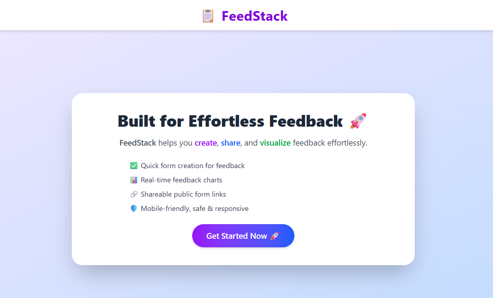
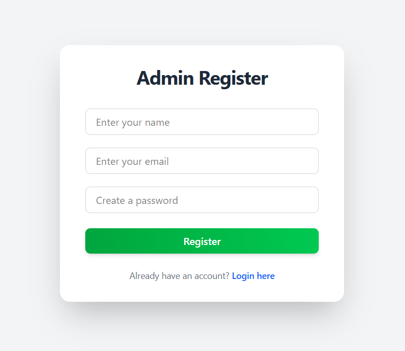
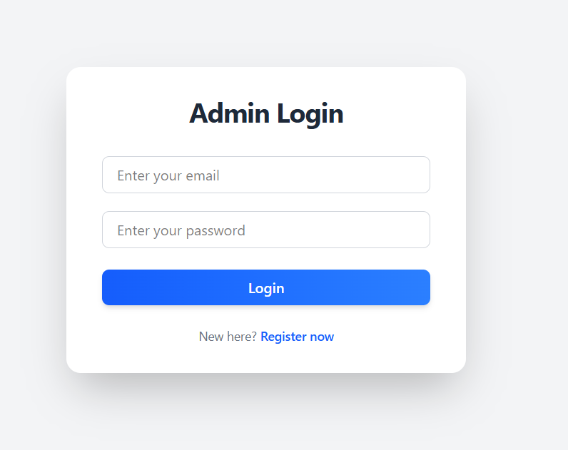
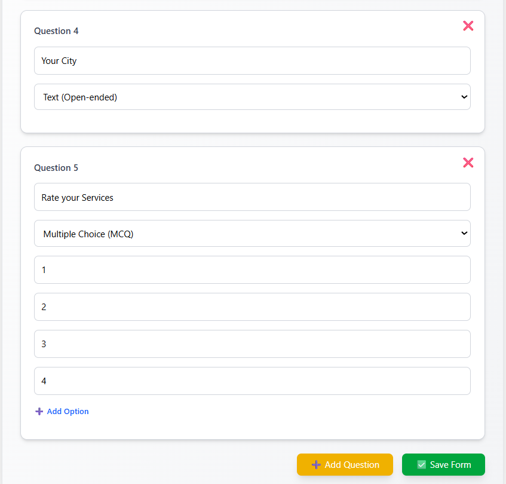
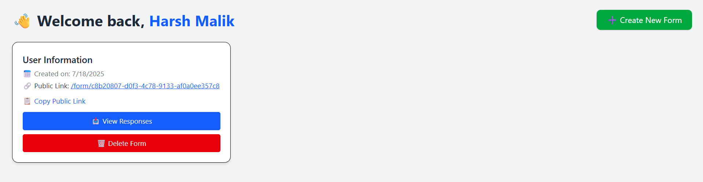
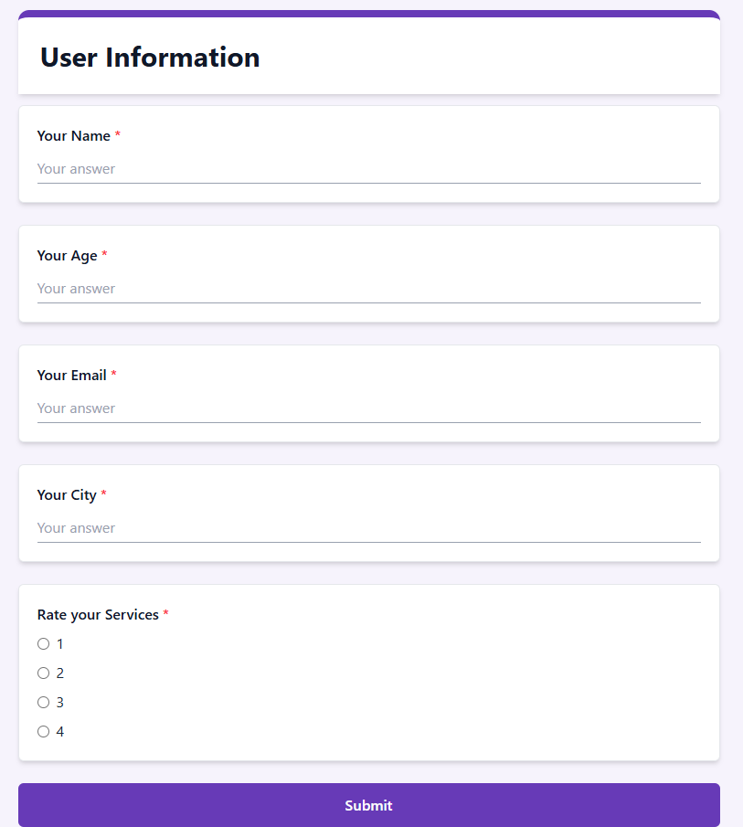
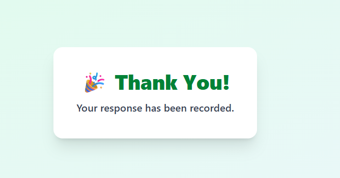
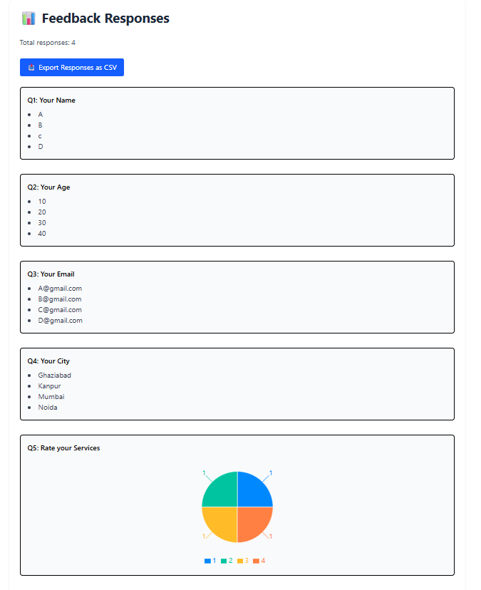
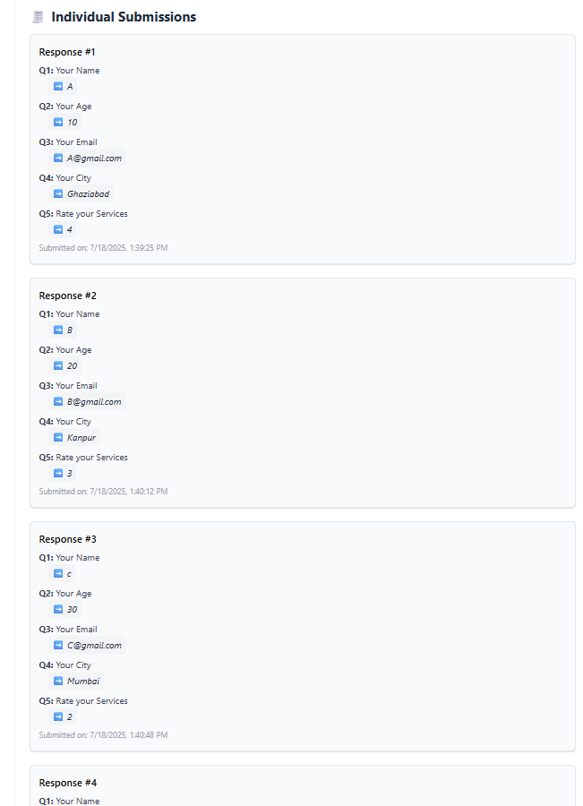

# 📝 FeedStack

FeedStack makes creating, sharing, and visualizing feedback forms simple and efficient — with secure authentication, real-time charts, and mobile-first design.

---

## 🌟 Features

* 🔐 Admin-only access: register, login, create/edit/delete forms
* 📝 Dynamic forms: text & MCQ (up to 4 options)
* 🌐 Public link: shareable form, styled cleanly like Google Forms
* 📊 Real-time analytics with charts
* ✅ Thank you page after submission (auto redirect, no buttons)
* 📱 Fully responsive, secure, and mobile-ready

---

## 🛠️ Tech Stack

| Layer      | Tech                                   |
| ---------- | -------------------------------------- |
| Frontend   | React + Vite + Tailwind CSS            |
| Charts     | Recharts                               |
| Backend    | Node.js + Express + MongoDB + Mongoose |
| Auth       | JWT + bcrypt                           |
| Deployment | Render (backend), Vercel (frontend)    |

---

## 📁 Project Structure

### 🔧 Backend (`/backend`)

* `server.js` – Express server entry point
* `config/db.js` – MongoDB connection
* `models/` – Mongoose schemas (`User`, `Form`, `Response`)
* `controllers/`

  * `authController.js` – Login / Register logic
  * `formController.js` – Form creation and retrieval
  * `responseController.js` – Storing & fetching responses
* `routes/` – API routes for each controller
* `middlewares/` – JWT middleware for route protection
* `.env` – Environment variables

### 💻 Frontend (`/frontend`)

* `api/axios.js` – Axios instance setup
* `context/AuthContext.jsx` – Authentication context
* `pages/` – Main pages

  * `Home.jsx`, `Login.jsx`, `Register.jsx`
  * `CreateForm.jsx`, `FillForm.jsx`, `ThankYou.jsx`
  * `Dashboard.jsx`, `Responses.jsx`
* `App.jsx`, `main.jsx` – Root structure & routing
* `public/` – Contains screenshots and assets
* `.env` – Frontend API base URL
* `tailwind.config.js`, `vite.config.js`

---

## 🧠 Design Decisions

* ✅ **Tailwind CSS**: For fast, responsive styling
* ✅ **JWT Auth**: Protects admin routes securely
* ✅ **Recharts**: Interactive data visualization
* ✅ **MongoDB Atlas**: Flexible, cloud database
* ✅ **Slug-based sharing**: Unique, non-guessable form links
* ✅ **No Redux**: Chose Context API for lighter state needs

---

## 🚀 Running Locally

### 1. Clone the Repo

```bash
git clone https://github.com/Harsh9540/feedback-form-project
cd feedback-form-project
```

### 2. Setup Backend

```bash
cd backend
npm install
```

Create a `.env` file in `/backend` with:

```env
PORT=5000
MONGO_URI=your_mongodb_uri
JWT_SECRET=your_jwt_secret
```

Start the server:

```bash
npm run dev
```

### 3. Setup Frontend

```bash
cd ../frontend
npm install
```

Create a `.env` file in `/frontend` with:

```env
VITE_API_URL=http://localhost:5000/api
```

Run frontend:

```bash
npm run dev
```

---

## 📸 Screenshots

### 🏠 Home Page



### 🔐 Register Page



### 🔓 Login Page



### ❌ No Form Created


### 🛠️ Create Form



### ✅ Created Form



### 🧑‍💬 User Feedback Form



### 🎉 Thank You Page



### 📊 Result View



### 📈 Result View 2



---

## 📦 Deployment

* **Frontend**: [Vercel](https://vercel.com)
* **Backend**: [Render](https://render.com) 

---

## 🙌 Credits

Made with ❤️ by **Harsh Malik**

> Connect on [GitHub](https://github.com/Harsh9540)

---

## 📄 License

This project is licensed under the [MIT License](LICENSE)

---

## 💡 Tip for Evaluators

To test as an **admin**, register and create a form at `/register`.
For **public user**, access the generated form URL like:

```
https://feedstack.vercel.app/fill/<slug>
```

Thank you for checking out **FeedStack**!
